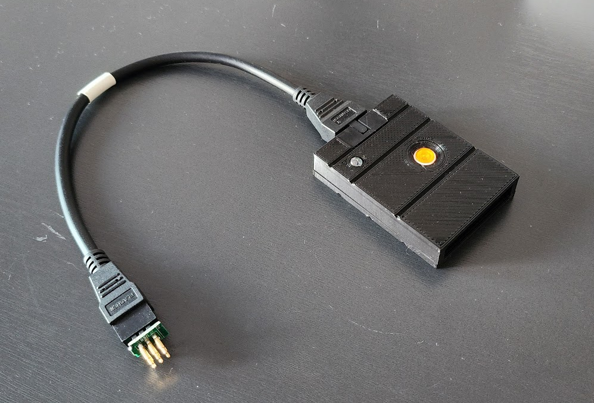
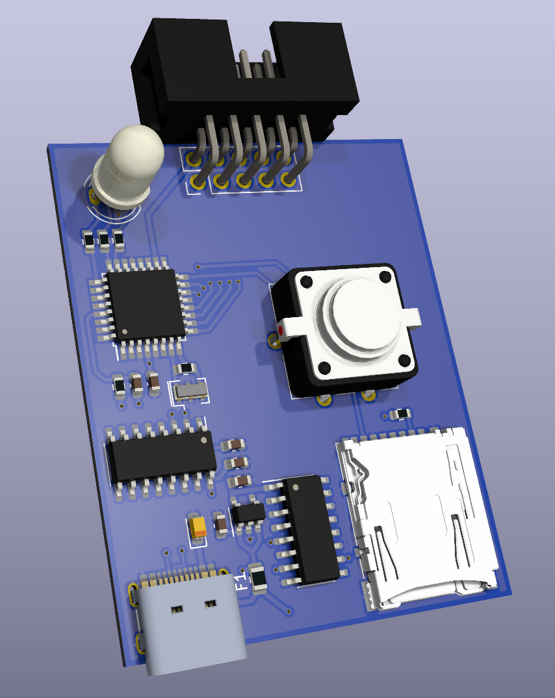
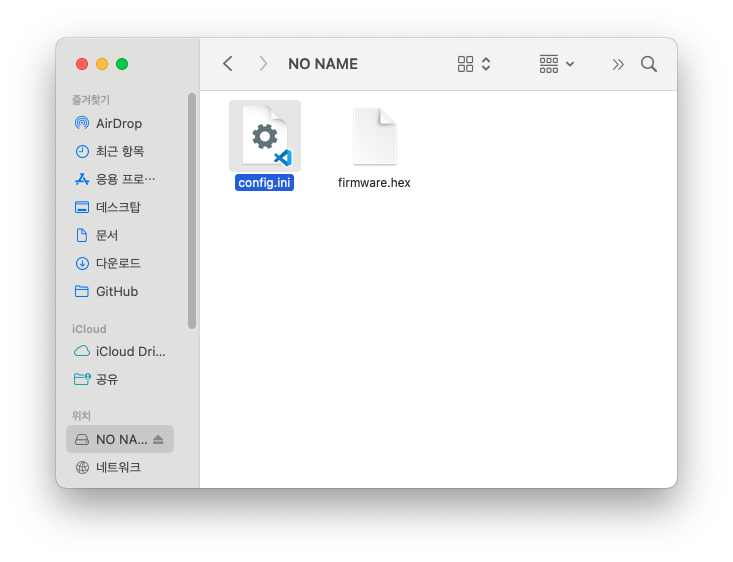

## What is this?



SD 카드에 저장된 펌웨어를 타겟 AVR 장치로 플래싱하는 Standalone AVR Programmer 입니다.  
이 장치는 PC 가 필요없으며 간편하게 버튼 클릭만으로 타겟 장치의 IC 를 판별하여 펌웨어를 쓸수 있습니다.  
또한 ATtiny 부터 ATmega328PB 및 ATmega2560 등 ATmel 사의 다양한 AVR 을 지원합니다.

본 프로젝트는 [Gammon Forum](http://www.gammon.com.au/forum/?id=11638)의 내용을 바탕으로 제작되었습니다.

## Introduction

빌드된 펌웨어 파일 `firmaware.hex` 을 SD 카드에 옮겨준 후 장치에 삽입하고 버튼 만 누르면 됩니다.  
PlatformIO 에서 빌드된 펌웨어는 `firmaware.hex` 이름으로 `.pio/build` 폴더에 생성됩니다.  
ArduinoIDE 를 사용하는 경우 `Ctrl + Alt + S` 로 컴파일된 바이너리 파일 생성 후 `firmaware.hex` 로 이름을 바꿔서 사용하면 됩니다.

### Inside

PCB는 ATmega328P 제품을 사용하여 제작되었습니다.  
필요한 경우 ATmega2560 나 ATmega32u4 같은 다른 IC 를 사용하여 만들수도 있습니다.

  
  
USB C 포트는 시리얼 통신을 지원하며, 아두이노 부트로더 내장시 USB 를 통해 펌웨어를 쉽게 수정할 수 있습니다.  
부트로더가 내장되지 않은 IC 를 사용하는 경우 PCB 에 실장되는 IC를 위한 ICSP 가 없기 때문에 사전에 프로그램을 다운받는 것이 좋습니다.  
저렴하고 구하기쉬운 최소한의 부품들로 구성하였기 때문에 쉽게만들 수 있습니다.

자세한 내용은 [회로도](PCB/Schematic.pdf)를 참조하세요.

회로도와 부품 배치 데이터, 케이스 3D 모델, 거버파일은 PCB 폴더에 있습니다.

### Video

[](https://youtu.be/CiSJQsz9dUg)

## CUSTOM FUSE

**이 기능은 사용시 주의가 필요합니다.**  
**CUSTOM FUSE 는 잘못 사용하면 IC 를 더 이상 사용할 수 없는 상태가 될 수 있습니다.**  
퓨즈 설정에 익숙하지 않다면 [퓨즈 계산기](https://www.engbedded.com/fusecalc/) 를 이용하는 것이 좋습니다.

`platformio.ini` 애서 CUSTOM_FUSE 활성화 방법입니다. (`ArduinoIDE` 를 사용하는 경우 `#define` 으로 스케치 상단에 정의합니다.)  
SD 카드를 사용하는 `CUSTOM_FUSE = 2`, `DEBUG_LV = 0` 가 기본 설정입니다.

```c
// File : platformio.ini
// @PlatformIO

build_flags =
; CUSTOM_FUSE 0 CUSTOM_FUSE 사용안함, 타겟 장치의 기본 세팅값 사용
; CUSTOM_FUSE 1 fuse.h 파일에 저장된 퓨즈세팅 사용
; CUSTOM_FUSE 2 SD 카드의 config.ini 파일로 부터 퓨즈 세팅 읽어옴
  -D CUSTOM_FUSE=2
; DEBUG_LV 0 디버그 모드 끔, 메모리 확보를 위해 끄는 것을 권장합니다
; DEBUG_LV 1 정의된 모든 동작을 모니터링
; DEBUG_LV 2 타겟 IC 식별과 SD 카드 퓨즈 세팅 동작 위주
  -D DEBUG_LV=0
  -D SERIAL_DISABLE=false ; 시리얼 통신 활성화
```

### `fuse.h` 파일을 사용한 CUSTOM_FUSE 설정

`platformio.ini` 의 내용을 다음과 같이 수정 한 후 AVR_FLASHER 에 업로드합니다.
```c
// File : platformio.ini
// @PlatformIO

build_flags =
  -D CUSTOM_FUSE=1
  -D DEBUG_LV=0
  -D SERIAL_DISABLE=true
```

fuse.h 를 사용한 방법은 메모리를 더 적게 사용하지만 장치를 매번 다시 컴파일 해줘야하는 단점이 있습니다.

```c
// File : src/fuse.h
/*
 * IC 와 퓨즈 정보를 아래 양식에 맞게 작성하여 사용합니다.
 * Available IC Table 에 정의된 이름과 동일하게 정의해야 합니다. (대소분자 구분)
 */
#ifdef ATmega32U4
#define AVR_CORE "ATmega32U4"
const byte low_fuses = 0xFF;
const byte high_fuses = 0xD8;
const byte extended_fuses = 0xCB;
const byte lock_bits = 0xFF;
#endif
```

```c
// File : src/main.cpp
// platformio.ini 에서 정의하였다면 하지 않아도 됨
#define CUSTOM_FUSE true
#define ATmega32U4
```

### SD 카드의 `config.ini` 파일을 사용한 CUSTOM_FUSE 설정

SD 에 저장된 설정값을 사용하는 방법은 메모리를 조금 더 사용합니다.  
AVR_FLASHER의 펌웨어 변경없이 원하는 Fuse 값을 SD 카드에 넣어주기만 하면 되기 때문에 좀 더 편리합니다.  
단점으로 `DEBUG_LV 1` 과 함께 사용시 시스템 메모리가 2KB 이하인 IC는 메모리 부족으로 IC 가 리셋 될수 있습니다.  
따라서 CUSTOM FUSE 설정에 SD 카드 모드 사용시 `DEBUG_LV 0` 또는 `DEBUG_LV 2` 로 설정해야 합니다.

먼저 `platformio.ini` 의 내용을 다음과 같이 수정하여 AVR_FLASHER 에 업로드합니다
```c
// File : platformio.ini
// @PlatformIO

build_flags =
  -D CUSTOM_FUSE=2
  -D DEBUG_LV=0
  -D SERIAL_DISABLE=true
```

그 다음 SD 카드에 다음과 같이 `config.ini` 파일을 생성합니다.  


`config.ini` 파일 내용은 다음과 같은 양식으로 작성합니다.

```
ATmega328P:FFDAFDFF
```

':' 를 구분 자로 사용하며 앞쪽에는 IC 의 이름 뒷 쪽에는 Fuse 설정을 적습니다.  
Fuse 의 순서는 왼쪽 부터 Low/High/Extended/Lockbits 입니다.

## Available IC Table

```c
// Atmega 칩들의 시그니처 코드입니다. 이 데이터들을 기준으로 타겟 칩을 인식합니다.
const signatureType signatures[] PROGMEM = {
    //     signature        description   flash size   bootloader  flash  fuse     timed
    //                                                     size    page    to      writes
    //                                                             size   change

    // Attiny84 family
    {{0x1E, 0x91, 0x0B}, "ATtiny24", 2 * kb, 0, 32, NO_FUSE, false},
    {{0x1E, 0x92, 0x07}, "ATtiny44", 4 * kb, 0, 64, NO_FUSE, false},
    {{0x1E, 0x93, 0x0C}, "ATtiny84", 8 * kb, 0, 64, NO_FUSE, false},

    // Attiny85 family
    {{0x1E, 0x91, 0x08}, "ATtiny25", 2 * kb, 0, 32, NO_FUSE, false},
    {{0x1E, 0x92, 0x06}, "ATtiny45", 4 * kb, 0, 64, NO_FUSE, false},
    {{0x1E, 0x93, 0x0B}, "ATtiny85", 8 * kb, 0, 64, NO_FUSE, false},

    // Atmega328 family
    {{0x1E, 0x92, 0x0A}, "ATmega48PA", 4 * kb, 0, 64, NO_FUSE, false},
    {{0x1E, 0x93, 0x0F}, "ATmega88PA", 8 * kb, 256, 128, extFuse, false},
    {{0x1E, 0x94, 0x0B}, "ATmega168PA", 16 * kb, 256, 128, extFuse, false},
    {{0x1E, 0x94, 0x06}, "ATmega168V", 16 * kb, 256, 128, extFuse, false},
    {{0x1E, 0x95, 0x0F}, "ATmega328P", 32 * kb, 512, 128, highFuse, false},
    {{0x1E, 0x95, 0x16}, "ATmega328PB", 32 * kb, 512, 128, highFuse, false},
    {{0x1E, 0x95, 0x14}, "ATmega328", 32 * kb, 512, 128, highFuse, false},

    // Atmega644 family
    {{0x1E, 0x94, 0x0A}, "ATmega164P", 16 * kb, 256, 128, highFuse, false},
    {{0x1E, 0x95, 0x08}, "ATmega324P", 32 * kb, 512, 128, highFuse, false},
    {{0x1E, 0x96, 0x0A}, "ATmega644P", 64 * kb, 1 * kb, 256, highFuse, false},

    // Atmega2560 family
    {{0x1E, 0x96, 0x08}, "ATmega640", 64 * kb, 1 * kb, 256, highFuse, false},
    {{0x1E, 0x97, 0x03}, "ATmega1280", 128 * kb, 1 * kb, 256, highFuse, false},
    {{0x1E, 0x97, 0x04}, "ATmega1281", 128 * kb, 1 * kb, 256, highFuse, false},
    {{0x1E, 0x98, 0x01}, "ATmega2560", 256 * kb, 1 * kb, 256, highFuse, false},

    {{0x1E, 0x98, 0x02}, "ATmega2561", 256 * kb, 1 * kb, 256, highFuse, false},

    // AT90USB family
    {{0x1E, 0x93, 0x82}, "At90USB82", 8 * kb, 512, 128, highFuse, false},
    {{0x1E, 0x94, 0x82}, "At90USB162", 16 * kb, 512, 128, highFuse, false},

    // Atmega32U2 family
    {{0x1E, 0x93, 0x89}, "ATmega8U2", 8 * kb, 512, 128, highFuse, false},
    {{0x1E, 0x94, 0x89}, "ATmega16U2", 16 * kb, 512, 128, highFuse, false},
    {{0x1E, 0x95, 0x8A}, "ATmega32U2", 32 * kb, 512, 128, highFuse, false},

    // Atmega32U4 family -  (datasheet is wrong about flash page size being 128 words)
    {{0x1E, 0x94, 0x88}, "ATmega16U4", 16 * kb, 512, 128, highFuse, false},
    {{0x1E, 0x95, 0x87}, "ATmega32U4", 32 * kb, 512, 128, highFuse, false},

    // ATmega1284P family
    {{0x1E, 0x97, 0x05}, "ATmega1284P", 128 * kb, 1 * kb, 256, highFuse, false},
    {{0x1E, 0x97, 0x06}, "ATmega1284", 128 * kb, 1 * kb, 256, highFuse, false},

    // ATtiny4313 family
    {{0x1E, 0x91, 0x0A}, "ATtiny2313A", 2 * kb, 0, 32, NO_FUSE, false},
    {{0x1E, 0x92, 0x0D}, "ATtiny4313", 4 * kb, 0, 64, NO_FUSE, false},

    // ATtiny13 family
    {{0x1E, 0x90, 0x07}, "ATtiny13A", 1 * kb, 0, 32, NO_FUSE, false},

    // Atmega8A family
    {{0x1E, 0x93, 0x07}, "ATmega8A", 8 * kb, 256, 64, highFuse, true},

    // ATmega64rfr2 family
    {{0x1E, 0xA6, 0x02}, "ATmega64rfr2", 256 * kb, 1 * kb, 256, highFuse, false},
    {{0x1E, 0xA7, 0x02}, "ATmega128rfr2", 256 * kb, 1 * kb, 256, highFuse, false},
    {{0x1E, 0xA8, 0x02}, "ATmega256rfr2", 256 * kb, 1 * kb, 256, highFuse, false},

};
```
